# e2e-audio 📻🔊🦻
e2e-audio :  End to End Baseline Audio Summarization | Agent Assist, DLP API, Baseline Summarization model |

## Objectives
- Configure conversation profile in Agent Assist
- Run PII redaction on audio transcripts using Data Loss Prevention API
- Generate summaries from Baseline Summarization Model
- Summarization baseline model in Agent Assist enables users to customize content of the summary by selecting from following predefined sections:
    - Situation: What customer needs help with or has question about.
    - Action: What agent does to help customer.
    - Resolution: Result of customer service.
    - Customer satisfaction: "Unsatisfied" if customer is unsatisfied at the end of conversation & "Satisfied" otherwise.
    - Reason for cancellation: If customer requests to cancel service. N/A otherwise.
    - Entities: The key-value pairs of important entities extracted from conversation.

## E2E Baseline Audio Summarization

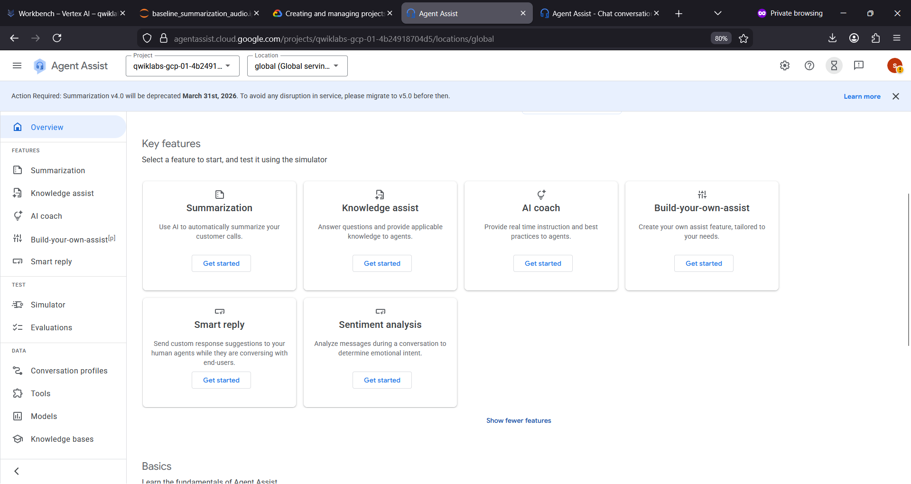

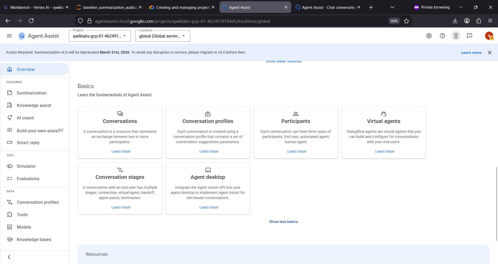

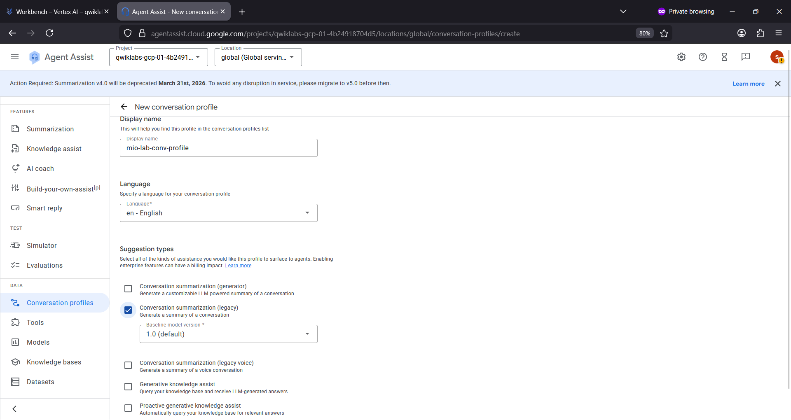

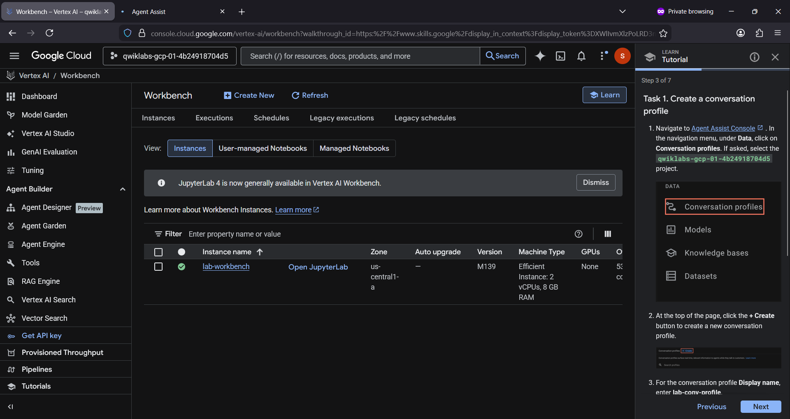

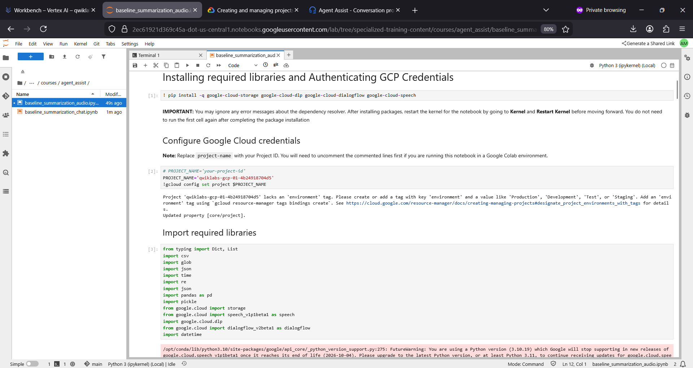

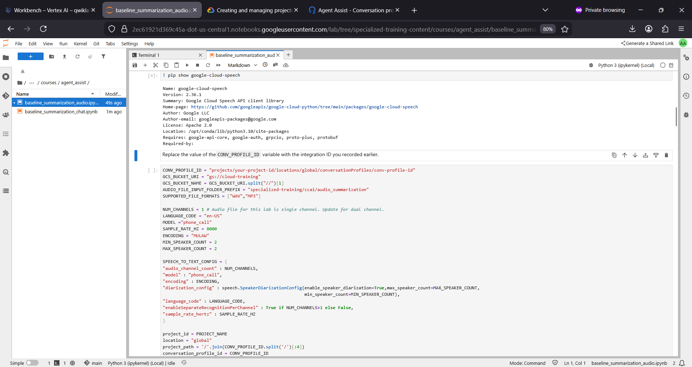

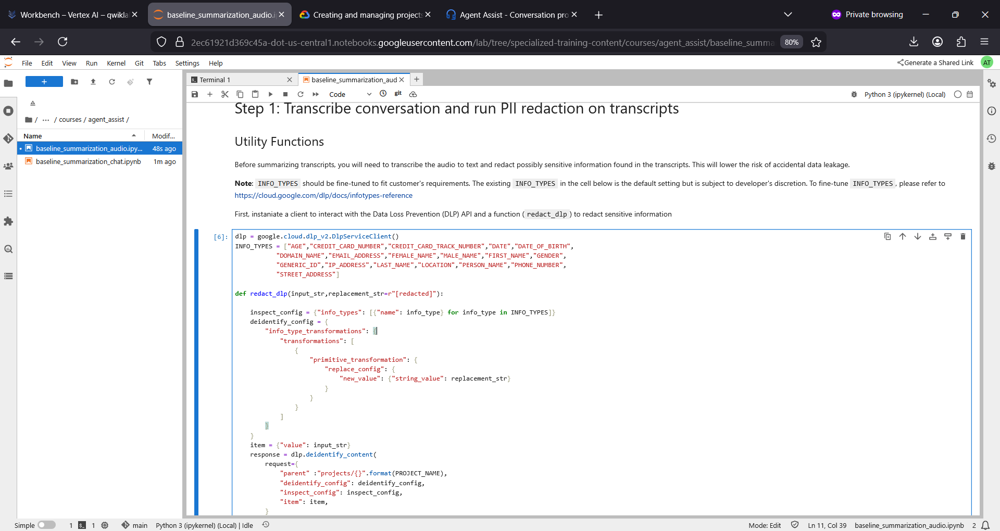

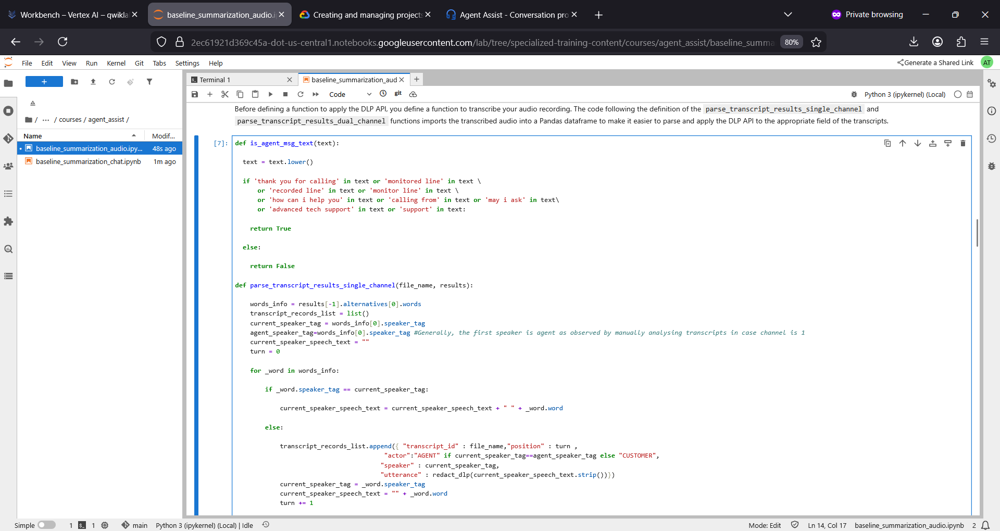

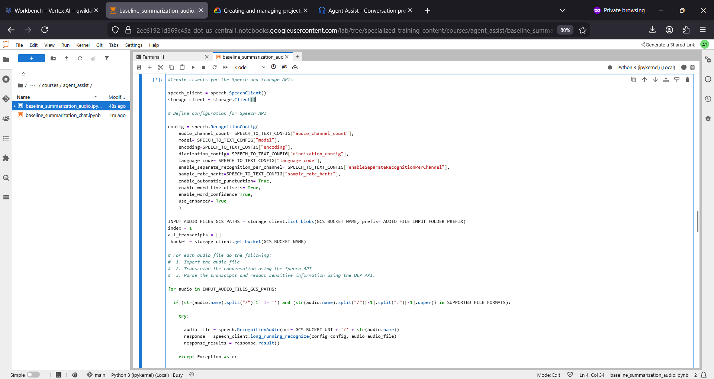

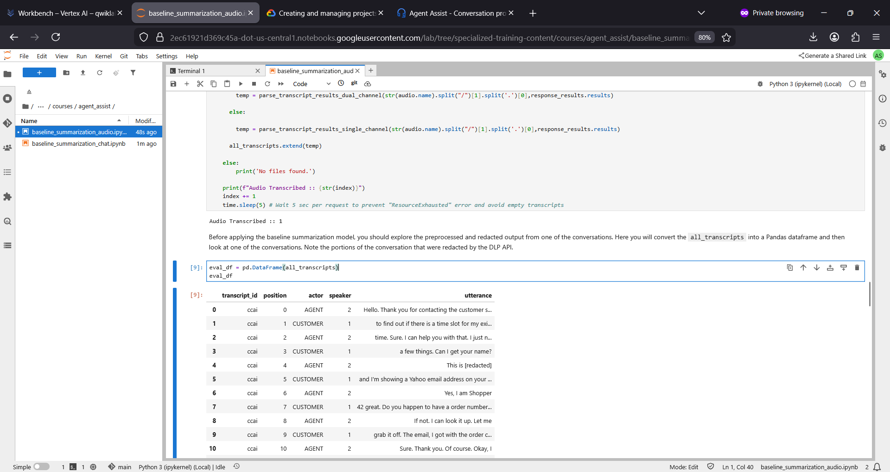

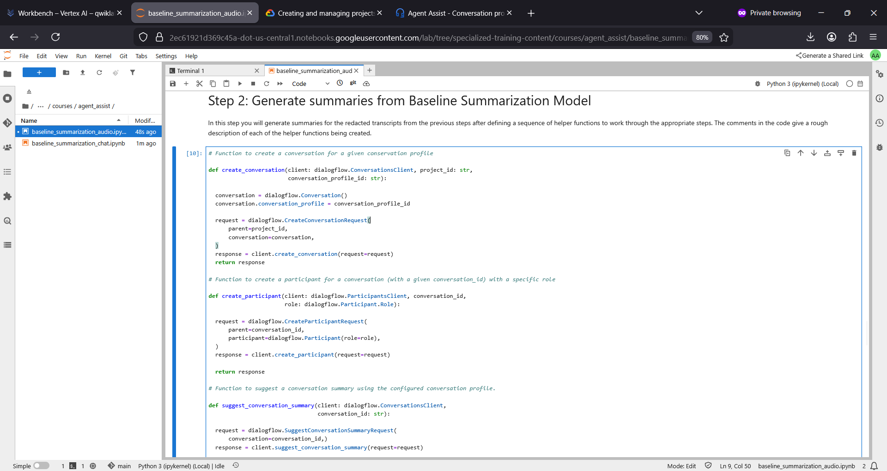

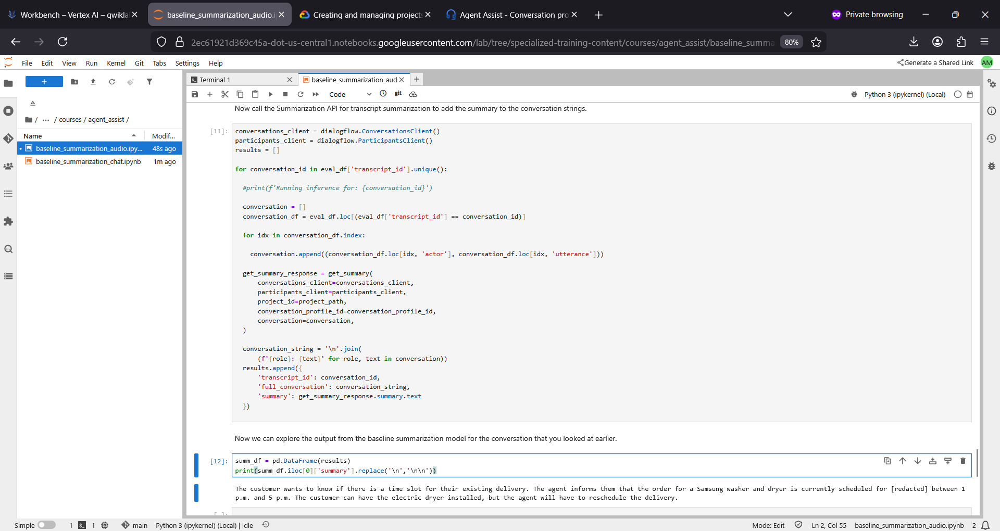

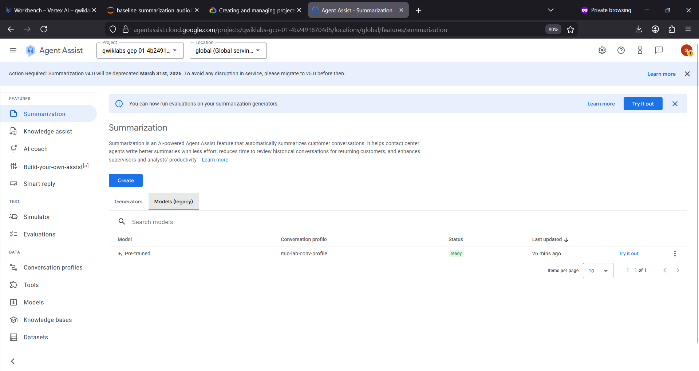

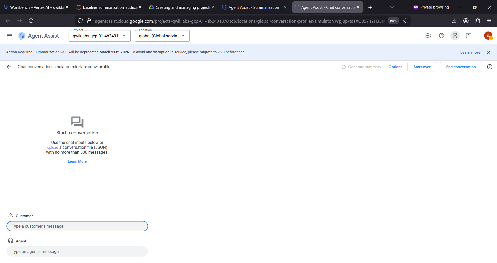

